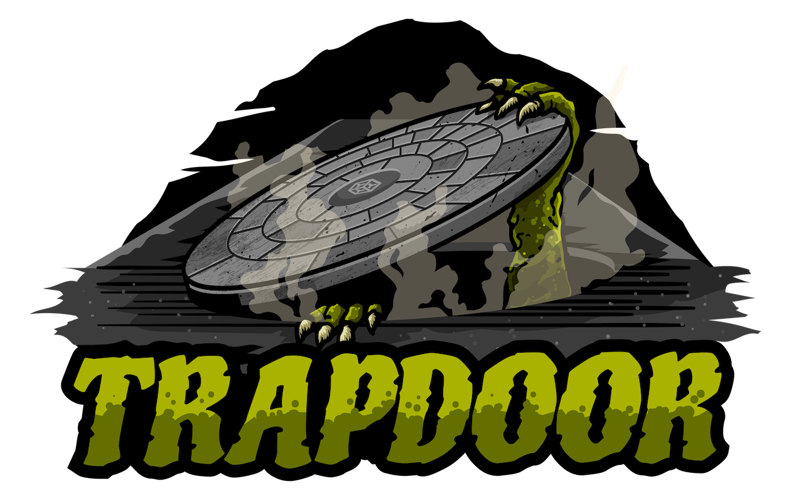
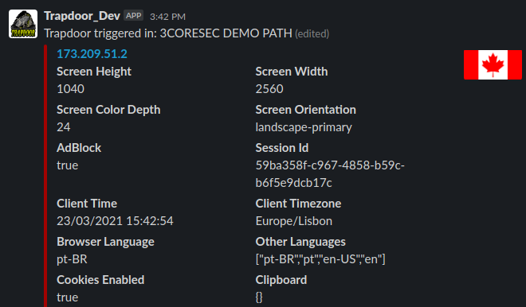
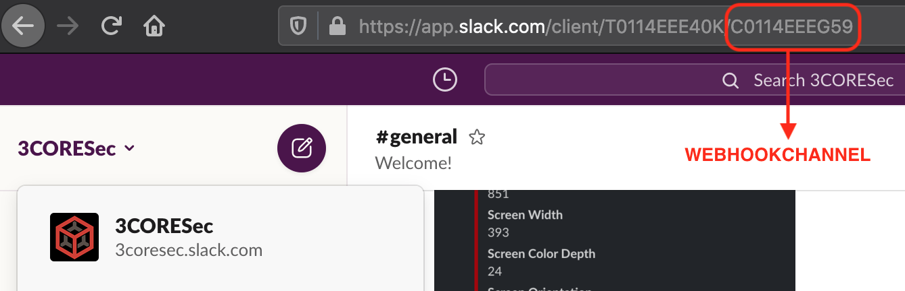

<p align="center"></p>

# Trapdoor - A serverless honeytoken framework

Trapdoor is an AWS Serverless Application meant to create and alert on [honeyTokens](https://community.broadcom.com/symantecenterprise/communities/community-home/librarydocuments/viewdocument?DocumentKey=74450cf5-2f11-48c5-8d92-4687f5978988&CommunityKey=1ecf5f55-9545-44d6-b0f4-4e4a7f5f5e68&tab=librarydocuments).



- Slack Notifications
- Aggregation & Client Tracking on Slack Notifications
- HTTP-based and JavaScript-based fingerprinting
- Custom paths and friendly reminders
- & more!

Trapdoor is inspired by the awesome work of [Adel](https://twitter.com/0x4d31) in [honeyLambda](https://github.com/0x4D31/honeyLambda).

Read the following articles to know more about the project:

- [Trapdoor - The serverless HTTP Honeypot](https://blog.3coresec.com/2021/03/trapdoor-serverless-http-honeypot.html)

## Installation

Trapdoor is available as a serverless application on AWS Serverless Application Repository. In the region where you'd like to deploy Trapdoor, visit the Serverless Application Repository _(in AWS Console, just search for it in the Services section)_ and head over to Available Applications.

Search for Trapdoor _(make sure to enable "show apps that create custom IAM roles or resources policies")_ and click on deploy.

You'll have to provide some input to the application before it can be deployed to your account. Please check the **Slack Setup** section below before continuing.

## Configuration

### Slack Setup

Trapdoor relies on Slack to provide you with alerts. This section will provide you with detailed information on how to create an app/bot to send your Trapdoor notifications.

1. Visit the [Apps section](https://api.slack.com/apps) on Slack and click on **Create New App**
2. Give it a name and choose the desired Slack
3. Visit the **OAuth & Permissions** section of the app and, under **Scopes - Bot Token Scopes**, "Add a OAuth Scope" for `chat:write`
4. At the top of the screen click on **Install to Workspace** and make note of `Bot User OAuth Token`
5. Invite the bot to the channel for which you'd like to have the messages posted to _(simply typing @bot_name will allow you to do so)_

Additionally you'll also require the ID of the channel that Trapdoor will be sending messages to. You can retrieve this information by visiting the channel in Slack Web, as demonstrated in the image below:

<p align="center"></p>

You now have all the information required to deploy via the AWS Serverless Application Repository.

- **SLACKPATH:** `https://your_team.slack.com` _(example: https://3coresec.slack.com)_
- **WEBHOOKCHANNEL:** ID that was retrieved via Slack Web _(example: `C0114EEEG59`)_
- **WEBHOOKTOKEN:** `Bot User OAuth Token` from the previously created app

### Trapdoor Setup

You can create your tokens by editing the `config.json` _(in the AWS Lambda page)_ and adding both a path as well as a friendly reminder:

```
...
{
  "Paths": {
    "admin": "Token present in honeypot in Germany",
    "ftp": "Token from .txt in Raspberry"
  },
...
```

### Domains & Customization

Consider using your custom domains instead of the AWS API URLs _(and map them to the /Prod stage in AWS API)_ so that your tokens can be made available under, for example, `https://important-corp.com/login`. Bear in mind that you can associate unlimited *(different)* domains to an API in AWS API GW, so it's really up to you to configure the best deception options for your tokens 🕵🏻‍♂️

## Usage

Using Trapdoor is as simple as visiting the AWS API URL _(or domain)_. You can retrieve your API Invoke URL by going to AWS API GW -> serverlessrepo-Trapdoor -> Stages -> Prod.

While all paths *($API/Prod/WHATEVER)* are accepted and alerted, choosing a path that is configured in Trapdoor `config.json` will provide you with a friendly reminder of where that token is located/stored.

## Feedback

Found this interesting? Have a question/comment/request? Let us know!

Feel free to open an [issue](https://github.com/3CORESec/Trapdoor/issues) or ping us on [Twitter](https://twitter.com/3CORESec). We also have a [Community Slack](https://launchpass.com/3coresec) where you can discuss our open-source projects, participate in giveaways and have access to projects before they are released to the public.

[](https://twitter.com/3CORESec)

## Legal notice

3CORESec is releasing this project as a proof-of-concept for the research community.

Please remember that it might not be legal to run Trapdoor in some countries and that the information you will be accessing could be considered personal data.

If you decide to deploy, install or run Trapdoor you will be agreeing to release and hold us harmless from any responsibility resulting or arising directly or indirectly from the use of Trapdoor.

You are solely and exclusively responsible for the use of Trapdoor.
